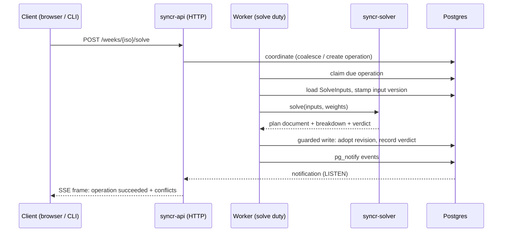

# syncr: Architecture Overview

This page maps the repository itself: what each member owns, how one solve travels from a client request to a verdict event, and which compose topologies an operator builds and when. It covers stable concepts. Volatile detail (recipe bodies, image tags, configuration figures) stays in the files that own it; each section says where to look.

For the product definition and domain model, see [prd.md](prd.md). For setup and the per-member workflow, see the root [README](../README.md) and `just --list`.

## Repository members

The Python members form a dependency chain: `syncr-common` at the bottom, then `syncr-domain`, then `syncr-solver` and `syncr-learning`, then `syncr-api` at the top. No member imports upward.

| Member | Responsibility |
|---|---|
| `packages/syncr-common` | Shared infrastructure: logging, metrics, health checks, settings. Knows nothing about scheduling. |
| `packages/syncr-domain` | The pure model: entities, invariants, interval and discretionary arithmetic. Performs no I/O, so it runs anywhere. |
| `packages/syncr-solver` | Placement: turns `SolveInputs` plus a weight set into a plan document with per-block reasons. Deterministic and pure in everything a stored plan can observe. Zero ML dependencies by design; a boundary test fails the build if one appears. |
| `packages/syncr-api` | The FastAPI application, persistence, calendar adapters, the SSE event system, and the worker entrypoint. The only member that talks HTTP and owns database sessions on the request path. |
| `packages/syncr-learning` | Offline feature extraction and parameter fitting over confirmed outcomes, run as a nightly one-shot. The only member allowed to depend on scipy or scikit-learn. |
| `frontend/` | React SPA over the API. Response types are generated from the committed OpenAPI document, never hand-written. |
| `cli/` | Command-line OAuth client of the same API the browser uses, including an idempotency-key seam for scripted use. |
| `e2e/` | Playwright end-to-end suite, run against its own compose stack so it cannot touch a developer's or the deployment's volumes. |
| `deployments/` | Deployment-owned configuration and tooling: the `ops` package (backup, WAL shipping, PITR, restore drills), Prometheus/Alertmanager/Grafana configuration, probe scripts, and systemd timer units. |
| `justfile` | The single task runner. Every recipe's header comment states what it does and what it needs. |

The solver and learning boundary is enforced twice: `syncr-solver` declares no ML dependencies and a test asserts it, and the api and learning images are built so neither can import what it must not (`just image-boundary` proves both at runtime).

## The life of one solve

A solve is asynchronous by design. A client never waits for arithmetic; it requests work, and the result arrives as an event.

1. **Request.** The browser (or the CLI acting for the user or their agent) calls `POST /api/v1/weeks/{iso_week}/solve` on the api. Mutations such as pins and edits go through sibling routes; every one of them lands on the same coordinator.
2. **Coordinate.** `SolveCoordinator` enforces the single-flight invariant: at most one non-terminal solve exists per week. Requests inside the debounce window coalesce into the pending operation, an immediate request pulls its due instant forward, and a tradeoff request supersedes whatever is in flight because its answer must carry the concession that asked for it. Each mutation also bumps the week's input version.
3. **Claim and load.** The worker process ticks through its duties; the solve duty claims due operations one tenant at a time. Transaction one assembles `SolveInputs` from stored state (frame, commitments, templates, pins, tasks) and stamps the operation with the input version read at load time, not the version at creation.
4. **Solve.** Outside any transaction, dispatch calls `syncr_solver.solve(inputs, weights)`. The five phases are materialize/inherit, bind content into fixed slots, fill remaining work into open gaps, improve by bounded local search, and compute the verdict. Weights come from the newest active weight set the learning layer published.
5. **Adopt or discard.** Back in the worker, transaction two re-reads the version row `FOR UPDATE`. If the input version moved while the solve ran, the result is discarded as superseded and one follow-up operation is enqueued; nothing is rebased or partially applied. If the version held, the candidate is classified against the same live plan the solver read, adopted as a new revision, and the verdict transition is recorded inside the same guarded transaction.
6. **Publish and project.** Still in that transaction, the worker publishes operation and conflict events through Postgres `pg_notify`. Publishing rides the producer's own transaction, so a rolled-back write pushes nothing, and a refused event is logged and dropped rather than failing the solve that just landed. A follow-up projection duty keeps the owned calendar in step.
7. **Verdict event.** The api process holds a long-lived Postgres `LISTEN` connection feeding its in-process event hub. Every connected client holds an SSE stream (`GET /api/v1/events`) off that hub, so the browser and the CLI see the operation move to succeeded, along with any conflicts needing assent, within moments of the commit. The stream heartbeats so dead connections are detected; clients that miss everything can always refetch the week view and the verdict route.

Failure keeps the previous live plan intact: a stated cause replaces the result, retries follow the lifecycle's attempt bound, and a week left with no revision at all is materialized from its frame rather than left empty.

## Deployment topologies

Everything deploys from one base compose file plus overlays. An overlay carries overrides only and is never valid standalone; the paired `just` recipes pass the exact `-f` list, so "what is running" has one spelling per environment.

| Topology | Composition | When an operator composes it |
|---|---|---|
| Base | `docker-compose.yml` | Never alone. Declares the networks (including the internal `data-net` around Postgres), memory limits, restart policy, the one-image-two-entrypoints split for api and worker, and third-party images pinned to exact tags. |
| Dev | base + `docker-compose.dev.yml` via `just dev` | Local development. Adds bind mounts, autoreload, and the host ports production must not have, under its own project name so volumes stay separate. |
| Monitoring | dev + `docker-compose.monitoring.yml` via `just monitoring` | Local inspection of metrics and alerts. Six services joined to `app-net`, no host ports. |
| Deployed | base + monitoring + deploy + tunnel via the deploy recipes | Production on one host. The deploy overlay repins images by digest; the tunnel overlay adds the only ingress. |
| Restore drill | base + restore (+ deploy for digest pins) via `just restore-drill` | Recovery verification. Boots a scratch Postgres, an api against it, and the manifest fingerprint reader, deliberately without the tunnel. |

Two rules hold across all of them:

- **Digest pins.** The deploy overlay repins every image by digest: third-party images literally in the tree, refreshed deliberately with `just digests`; the project's own two images through required variables written to `deployments/digests.env` by the build pipeline, which is also what a rollback re-reads. A floating tag would make every redeploy an unreviewed change.
- **No published host ports in production.** The Cloudflare tunnel is the only ingress and makes outbound connections only; `just ports-check` asserts no resolved service publishes a port.

The `deployments/` tree belongs to this story rather than to application code: `ops/` is the package the backup, WAL-shipping, PITR, and restore-drill containers run; `prometheus/`, `alertmanager/`, and `grafana/` carry the monitored stack's configuration; `bin/` holds the probes that check the running stack rather than its files; and `systemd/` holds the timers that schedule the one-shots on the host. Its lint gate (`just lint-ops`) type-checks that package at the runtime image's language version, not just the repository's.

Migrations are part of deployment ordering, not application startup: they run as a one-shot between pull and start, so replicas cannot race and a boot either comes up ready or says why not on `/readyz`.
