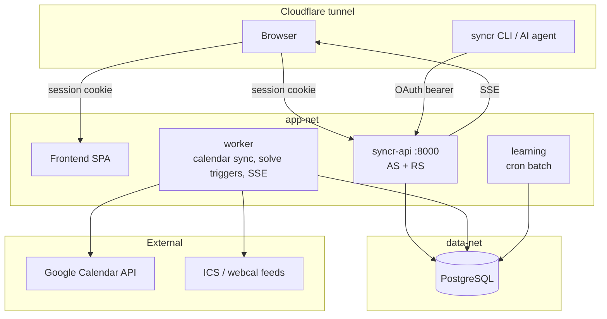

# syncr: Product Requirements

## 1. Overview

syncr is a scheduling and life-management system that owns the plan. It converts long-term time allocations and a short-term task backlog into a timeblocked week, projects that week to the user's calendar, and adapts the plan as reality diverges without rearranging it behind the user's back.

This document covers the product definition, the domain model, the scheduling algorithm, the learning layer, calendar integration, and the P0 delivery cut. It does not cover the API route catalog, the database schema, or the authorization model in detail. Those are published as their own references: [api.md](api.md), [database.md](database.md), and [authorization.md](authorization.md).

It does not cover the visual and interaction language either. `docs/DESIGN-LANGUAGE.md` is the authority for that, and this document defers to it wherever the two touch.

### 1.1. Why we are building this

The reference workflow is manual timeblocking in Apple Calendar, backed by sticky notes for tasks. Every day carries a full shape, including `Wake Up`, `Shower`, `Lunch`, `Dinner`, and `Sleep`, plus transit blocks such as `Leave for Uni`. Blocks are placed by hand, every day. How many there are is heavily user-dependent and is not a product constant: measured over one reference month of my own calendar, timed blocks averaged 8.9 a day, peaking at 16 in a day and 91 in a week. Those per-day figures come from that one measured month. The two weeks this document examines block by block are a later and separate period of the same calendar, an exam period rather than a teaching one, and neither period contains the other. Where a later section says *the reference weeks*, it means those two weeks. The two periods agree on the order of magnitude: those weeks hold 61 and 53 timed blocks, or 8.7 and 7.5 a day, so the correction to an earlier draft's much higher figures rests on two independent samples rather than one.

That workflow fails in three specific ways:

- **Authoring cost.** Every block is placed by hand, and most of a week is identical to the week before it. Almost all of the authoring is therefore repeat authoring.
- **No late binding.** The calendar says `Leetcode`. It does not know which topic matters most this week, so the decision of what to work on happens at 7am with no information.
- **Silent overcommitment.** Sticky notes plus a calendar cannot detect that a week is impossible. The user discovers this on Thursday, by failing.

A fourth problem sits underneath: the user's mental model is a pie chart of time allocation, reviewed quarterly, from which a template of the ideal week is derived. Nothing in the current workflow connects that allocation model to what actually gets scheduled, and nothing measures the gap.

### 1.2. Scope

- Areas with time budgets, expressed as floors plus a proportional remainder.
- Tasks, Habits, and Routines as three distinct kinds of schedulable intent.
- Day-shape Templates and a WeekPattern that provide the skeleton of a week.
- Read-only ingest of external anchors, with user-declared anchor types that cast prep and recovery shadows.
- A deterministic solver that binds content into slots, places cadence items into gaps, and explains every placement.
- Infeasibility detection that exposes tradeoffs and refuses to choose for the user.
- A learning layer that fits per-user parameters from confirmed outcomes and manual edits.
- Projection of the plan to one calendar that syncr exclusively owns.
- A weekly planning-and-retro session and a daily confirmation pass.
- Web application as the primary surface, CLI as a secondary client for the user and the user's AI agent.

### 1.3. Key decisions made before drafting

| Decision | Choice |
|---|---|
| Plan ownership | syncr owns the plan. The calendar is a projection, not an input. |
| Calendar delivery | syncr writes to one calendar it exclusively owns. Subscribed ICS feeds are too slow (see section 4.2). |
| Change authority | syncr may add freely. It may never move or remove a block without user assent. |
| Scheduler | Deterministic. No language model in the placement loop. |
| Learning | Parameter fitting and learning-to-rank over an explicit objective. Not a sequence model (see section 5.2). |
| Calendar providers, P0 | Google Calendar API and generic ICS/webcal. Microsoft is blocked by policy (see section 4.2.1). |
| Task ownership | syncr owns tasks. It replaces sticky notes rather than integrating with a task manager. |
| Tenancy | Multi-tenant data model from the first migration. |
| Backend | Python and FastAPI, mirroring wren, with the solver and the learning layer as separate workspace packages. |

### 1.4. Key questions for review

- [ ] Is the discretionary-time denominator in section 3.1.2 the right basis for budget percentages, given it changes week to week?
- [ ] Are the learning convergence thresholds in section 4.4.2 realistic? They are my estimates, not measurements.
- [ ] Does the P0 cut in section 7 leave anything out that blocks daily use?
- [ ] Is `EditEvent` feature logging (section 4.4.4) capturing enough context to retrain a better model later? Partly answered: the pin counterfactual in section 3.7 obliges the superseded placement and its objective delta to be persisted permanently, which supplies the pairwise half of the signal. What stays open is whether the context snapshot around that pair is wide enough.

### 1.5. Delivery priority

1. **P0**: the full loop for a single user on a multi-tenant schema. Areas, all three intent kinds, templates, ICS and Google, anchors and shadows, solver with fixed weights, infeasibility, pin-and-reflow, weekly session, daily confirmation, timezones, and the learning layer with maturity gates.
2. **P1**: Microsoft personal accounts. Multi-user onboarding. MCP server.
3. **P2**: macOS bridge client for corporate calendars. Provider breadth. Signal inference.

## 2. Goals and Non-Goals

### 2.1. Goals

- **Eliminate repeat authoring.** The user defines a day shape once. syncr materializes it every week.
- **Decide what, not just when.** A slot declares an Area and a duration. syncr binds the specific task or habit at plan time, from current priorities and the backlog.
- **Surface impossibility before it happens.** When a week cannot hold its commitments, syncr says so during planning, quantifies the shortfall, and lists the tradeoffs.
- **Adapt without surprising.** The plan stays revisable indefinitely. Every destructive change waits for user assent.
- **Learn the user's real parameters.** Estimated durations, preferred times, and skip patterns are fitted from behavior, not asserted by the user.
- **Make review honest.** A day counts as recorded only when the user confirms it. Unconfirmed days are excluded from both reviews and learning.

### 2.2. Non-Goals

syncr is explicitly not:

- a team or shared calendar, meeting scheduler, or availability-link tool;
- a notes, journal, or personal knowledge management application;
- a habit-streak application with badges or streak counters;
- a time tracker that infers activity from machine signals;
- an email client;
- a mobile application in P0, where the phone receives the calendar projection only;
- a replacement for the user's calendar as a read surface.

On the last point: the user keeps reading Apple Calendar on macOS and iPhone. syncr writes there. It does not ask the user to change where they look.

## 3. Domain Model and Core Mechanics

### 3.1. The frame and the budget

#### 3.1.1. Areas

An `Area` is a hierarchical life category that carries a time budget. Areas are permanent. A `Project` nests under an Area, carries a deadline and a completion state, and inherits its parent Area's allocation rather than claiming its own. Tasks and Habits belong to an Area, optionally through a Project.

Areas do triple duty: they are the wedges of the pie chart, the type of a template slot, and the category of a task. One concept, three uses. This is deliberate, and it is what allows a slot to say "one hour of Learning" and let syncr choose the content.

**An Area's identity is an assigned pigment from a fixed ramp.** Twelve Area pigments are sanctioned. One is assigned when the Area is created, and it can be re-picked only from the ramp: **there is no color picker.** The practical consequence is that beyond twelve top-level Areas the pigments repeat, and identity leans on the hatch and the Area's name instead.

#### 3.1.2. Budget as floors plus proportional remainder

A budget is expressed against **discretionary time**, which syncr computes per user per week as total time minus the circadian frame, minus external anchors, minus anchor shadows. Discretionary time therefore varies week to week.

That denominator has one hard prerequisite: **a `Routine` is a span, not a marker.** A `Sleep` routine of `23:00 + 8h` is what bounds the day. Without a duration on the frame there is nothing to subtract, so discretionary time cannot be computed at all. This is a requirement, not a preference.

**The unallocated residual is shown, not hidden.** Discretionary time that no Area claims gets an `Unallocated` wedge on the pie and an `Unallocated` row in the deviation bars. Measuring against *scheduled* time instead would inflate every Area's share by excluding exactly the hours the user never planned, so the report would read as healthy while the gap grew. The honest consequence is that the largest wedge is frequently "nothing planned", which looks like a defect until it is labeled, so it is labeled.

Pure percentages fail in exactly the wrong week: a heavy meeting week shrinks every wedge proportionally, so fitness starves precisely when the user is most stressed, while the budget still reports as met. Instead:

- An Area may declare an **absolute floor** in hours per week. Floors are non-negotiable inputs to the solver.
- Remaining discretionary time is split by **percentage** across Areas.

Oversubscription is expected and is reported, not prevented. Section 3.8 covers how.

#### 3.1.3. The pie review

The pie review runs on user demand or on a quarterly schedule, per user preference. It shows actual allocation against target per Area over the period, and it proposes revised percentages derived from observed behavior. The user approves, adjusts, or rejects the proposal. syncr never re-cuts the pie on its own.

**The review is three charts, not one.** A pie shows one series, so it structurally cannot show a gap. The settled split: a pie for composition now, stacked bars by week for trend over time, and signed deviation bars off a zero line for actual against target. `Unallocated` appears as a wedge on the pie and as a row in the deviation bars, for the reason in section 3.1.2.

A deviation bar is one ink. Area color encodes identity and cobalt encodes magnitude and direction, so under target extends one way from the zero line, over target the other, and the sign is a `+` or a minus rather than a hue.

> **Note:** the proposal half of the pie review requires a quarter of confirmed data before it can say anything. Until then the review shows the actual-versus-target gap only.

### 3.2. Three kinds of intent

Counting block origins across the two reference weeks (section 1.1):

| Origin | Share | Examples |
|---|---|---|
| Routine and circadian | ~40% | `Wake Up`, `Shower`, `Lunch`, `Dinner`, `Sleep` |
| Habit and cadence | ~30% | `Gym`, `Anki - F&F`, `Read`, `Valorant`, `Laundry`, `Groceries` |
| Task work | ~25% | `F&F Past Papers`, `Kim's Game Project`, `Make F&F Checklist` |
| Anchor and shadow | ~5% | `Foundation and Frontier of ML Exam`, `Kontron Placement Interview`, `Leave for Uni` |

Roughly 70% of blocks are not tasks. A task-only model would force the user to recreate `Gym` four times a week forever. The model therefore has three intent kinds:

- **`Task`**: finite and completable. Carries an estimate, an optional deadline, a priority, a minimum chunk, and a splittable flag.
- **`Habit`**: infinite and cadence-driven. Carries a cadence, a duration, a miss policy, and a binding source.
- **`Routine`**: the circadian frame. Carries a target time, a duration, and a flex band. Routines define how much time exists, so they are not budgeted as discretionary.

#### 3.2.1. Habit binding sources

A Habit answers *when and how often*. Its `bindingSource` answers *what exactly*, and one field covers every pattern in the reference weeks:

- **`fixed`**: the same content every occurrence. `Anki - F&F`.
- **`rotation`**: an ordered variant list and a cursor. `Gym` cycles `Shoulder & Arms → Legs → Chest & Back → Cardio`. The cursor advances **on completion, not on date**, so missing Tuesday leaves Wednesday on `Legs`.
- **`queue`**: cadence from the Habit, content pulled from the task backlog. `Leetcode` draws `Tries`, then `Graphs`, then `Dynamic Programming`.

**The rotation cursor is derived, and therefore read-only.** It is a projection of the append-only outcome log: `Gym` is on `Legs` *because* `Chest & Back` was confirmed complete. So there is no "set cursor" control. A wrong cursor means a wrong confirmation, which the user fixes on Today, which already supports backfill, after which the cursor re-derives. Overriding a single occurrence is a rebind, which is a pin, which is a mechanism that already exists. No new concept, and no way for the cursor to desync from the log that produced it.

Each Habit declares a miss policy: `forgive` (the occurrence vanishes), `debt` (it reschedules and accumulates), or `escalate` (it is raised in the weekly session).

### 3.3. Templates and the week pattern

A `Template` is a named day shape bound to a `DayType`. It holds `TemplateEntry` rows, each either:

- **concrete**: a specific Routine or Habit at a target time with a flex band, or
- **slot**: an Area plus a duration at a target time, with content bound late.

A `WeekPattern` maps each weekday to a DayType. Cadence lives on Habits, not on templates.

This replaces an earlier model with daily, weekly, and monthly template periods. Weekly and monthly recurrence is already expressible as `Habit.cadence`, so separate template periods would have required composition and override rules for no added expressiveness. Three concepts (Template, WeekPattern, Habit cadence) instead of three template periods.

**Template entries are pinned.** The solver does not move them. When an external anchor collides with a pinned entry, the solver does not silently displace it: it raises a conflict for the user to resolve (section 3.6). Pinned means never moved silently, not never moved.

The consequence is that the solver's search space is narrow. It does two things: bind content into fixed-time slots, and place cadence items into leftover gaps. It does not arrange the day.

### 3.4. External anchors and their shadows

Anchors are not one class. The reference weeks contain five distinct kinds, two of which are generated rather than imported:

| Class | Example | Origin |
|---|---|---|
| Hard external | `Kontron Placement Interview 6W1.2` | imported |
| Derived logistics | `Leave for Uni`, `Go Home` | generated from a location |
| Derived shadow | `Prep for Kontron Placement Interview` at 10:00 for a 16:00 interview | generated from an anchor type |
| Circadian frame | `Wake Up`, `Lunch`, `Sleep` | Routine, see section 3.2 |
| Flexible fill | `Leetcode`, `Laundry` | the solver's job |

The insight the reference weeks make explicit: **an anchor casts a shadow.** A 16:00 interview projects backwards into prep and transit, and forwards into decompression where deep work should not be scheduled. A 09:30 exam projects backwards into the previous evening. The user authored these shadows by hand.

In P0, shadows are **declared manually per anchor type**, not inferred. An `AnchorType` carries match rules (title substring plus source calendar) and a shadow specification: pre-buffer, post-buffer, transit minutes, and Areas forbidden afterwards. Rules evaluate in order, first match wins. A per-event override persists on the recurring series, so a daily standup is typed once, not 250 times. An untagged anchor is treated as opaque busy time with no shadow.

Automatic shadow inference is deferred. P0 makes no assumptions.

### 3.5. Plan state, reality state, and the append-only log

Three concepts that an earlier draft conflated under the word "committed":

| Concept | States | Meaning |
|---|---|---|
| **Plan state** | `planned` | Every future block is revisable. There is no frozen tier. |
| **Reality state** | `presumed` → `recorded` | A block becomes fact only when the user confirms the day. |
| **Change authority** | `auto` / `proposal` / `conflict` | Who may change the plan. See section 3.6. |

Storage is append-only, following the correction-chain pattern already proven in gofin's expense ledger. `PlanRevision` rows are never mutated; a new revision supersedes its predecessor. `BlockOutcome` rows record reality separately from plan.

Three requirements force append-only storage rather than a mutable schedule table:

1. Backfill. The user can confirm any past day at any time.
2. The churn objective term. The solver must know what the plan looked like when the user last saw it.
3. Learning. Training on edit diffs requires both the proposal and the accepted result.

A mutable plan table would make all three impossible, and the data loss would be unrecoverable.

Following wren's roadmap model, a `PlanRevision` stores the materialized plan as authoritative JSONB with write-derived scalar columns for querying. The repository re-derives every scalar on write, so the columns cannot drift from the document.

#### 3.5.1. Presumed and recorded

Per-block check-off during the day is optional. Blocks are **presumed** completed unless the user says otherwise, which keeps daily interaction cost near zero.

The evening pass **confirms** the day, converting presumed to recorded. Unconfirmed days display as unconfirmed and are **excluded from reviews and from learning**. This costs nothing and prevents the failure mode where a day the user disengaged from entirely is recorded as perfect, and the weekly review lies.

Block outcomes are `completed`, `partial` with actual minutes, `skipped`, or `moved`. **`partial` with actual minutes is a P0 requirement**, not an optional refinement: it is the sole source of the duration-estimate signal, and the estimate-accuracy metric in section 6 dies without it.

### 3.6. Change authority

The plan stays revisable, and syncr never rearranges it unattended. Those reconcile through an authority rule based on what a change does, not when it happens:

| Change type | Authority | Behavior |
|---|---|---|
| Fills empty space | **auto-applies** | A new task lands in a free gap. No approval, no notification. |
| Moves or drops an existing block | **proposal** | Waits quietly. No notification. Visible when the user looks. |
| External anchor overlaps a planned block | **conflict** | Notifies. Must be resolved. |

One sentence: **syncr may add, but may never move or remove without permission.**

The severity split matters. Without it, a trivial improvement nags exactly like a real conflict, the user mutes notifications within a week, and then misses the conflicts too. Only conflicts notify.

**Overlapping blocks are expected and supported**, because users multitask: a call taken on a commute, reading done during laundry. syncr's own solver output is overlap-free, so a visible overlap is either a user-authored multitask, which is legitimate and left alone, or an external anchor landing on a planned block, which is the conflict row above.

The solver runs on every relevant change, debounced. Its output is a `PlanRevision` with status `proposed`, never an application. Proposals supersede each other, so only the latest pending proposal exists. Past and in-progress blocks are immutable regardless of authority.

This replaces the descoped committed-versus-provisional model (section 5.3).

### 3.7. Pin and reflow

The weekly session involves a burst of manual edits followed by one approval. The naive implementation fights the user: they drag `Gym` to 13:00, the solver re-solves, three other blocks move, and the screen no longer matches the mental model they were building.

**Every manual edit is a pin.**

- Dragging a block pins it at that time.
- The solver reflows only the **unpinned** remainder around the pins. It never contradicts an edit the user just made.
- Pinned blocks are visually distinct, so the user can see what is locked.
- The infeasibility readout updates live as pins accumulate, so shortfalls surface during editing rather than after.
- One approve action commits the week.

A pin binds one block instance, and the binding does not persist across weeks. If it did, the user could hand-build a rigid schedule and starve the learner of exactly the signal it needs. The **record** of that pin does persist, permanently: the pin and the placement it overrode are training data (section 8.1). The binding and the record are different objects. One is a live constraint on next week's solve; the other is a fact about a week that has already happened, and facts do not expire.

Instead, **syncr detects repeated pins and proposes a template change**: "You have pinned `Gym` to 13:00 for three consecutive weeks. Move it in your Weekday template?" The user approves. This mirrors the pie review: syncr observes and proposes, the user decides. Templates absorb structural patterns; the learner absorbs statistical ones.

The mechanism has a second payoff. A pin is a labeled preference: *the user chose 13:00 when the solver proposed 06:00, on a Tuesday, with these anchors*. That is precisely the pairwise comparison that learning-to-rank consumes (section 4.4.3). The editing interaction and the training-data collection are the same interaction.

**A pinned block therefore shows what the solver would have chosen instead, and what that choice cost.** Otherwise a pin's reason is just "you put it here", which is true and unhelpful, and showing the superseded placement with its objective delta turns the pin into a visible trade. **That obliges the schema.** The superseded placement and its objective delta are persisted alongside every pin, permanently, in the append-only store (section 8.1). The cost is worth paying twice over: that pair is also exactly the comparison the learning layer consumes, so the data would be worth keeping even if the panel never showed it.

### 3.8. Infeasibility

The most valuable output of the system is sometimes a refusal rather than a schedule:

> You cannot finish `F&F Past Papers` by Friday 09:00. You are 1h20m short after honoring your Fitness floor. Options: drop `Kim's Game Project` this week, reduce the Sleep floor by 1h, breach the Fitness floor by 1h20m, or accept partial delivery.

syncr detects the shortfall, quantifies it, and enumerates the tradeoffs. It does not choose. The user may be tired and accept partial delivery, or cut sleep, or drop something. That decision belongs to them.

**Each tradeoff is an action that generates a `PlanRevision` with status `proposed`**, which the user then approves like any other proposal. No tradeoff mutates the plan directly. So the rule in section 3.6 that syncr may never move or remove without assent holds with no exception carved out for a warning panel, and the panel needs no mechanism of its own.

The same rule applies when the user's own pins make the week infeasible: **raise, warn, and allow.** syncr does not block approval of a knowingly-broken week.

Sleep is a negotiable resource with a user-set floor. The solver may propose spending it. It may not spend it silently.

### 3.9. Time zones

Time zones are foundational and retrofitting them is expensive, so they are in P0. The split is clean:

- **Anchors are absolute.** A meeting at 14:00 UTC stays at 14:00 UTC and renders in the active zone.
- **The frame is local.** `Wake 05:00` means 05:00 wherever the user is.

Scope: store instants in UTC with an associated zone, a per-user home zone, per-date-range travel overrides, render in the active zone, and stay correct across daylight-saving transitions. Changing zone re-derives the frame and triggers a reflow of the unpinned fill.

**Rendering is single-zone.** Every time in the product reads in the active zone, one zone at a time. Showing a second zone beside the first is out of scope: the block label budget is the tightest in the product, and two readings of one instant compete for the space a title needs.

**Explicitly out of scope**: modeling jet lag as a gradual circadian shift.

## 4. Design

### 4.1. Architecture



There is **no external/internal application split**. wren needed one because its MCP Resource Server was a separate deployable that must never forward an agent token downstream. syncr has no such hop: the CLI is an OAuth client of the same API the browser uses, holding an audience-bound scoped token. One application, two credential types.

This holds when MCP arrives in P1. syncr's API is both Authorization Server and Resource Server, so an MCP server becomes another bearer client. No internal application is ever needed.

#### 4.1.1. Workspace packages

A uv workspace with one lockfile, following wren's per-member-image pattern.

```
syncr/
├── packages/
│   ├── syncr-common/     infra: logging, metrics, health, config
│   ├── syncr-domain/     entities and invariants. pure, no I/O
│   ├── syncr-solver/     WeightSet + inputs -> Plan. no ML dependencies
│   ├── syncr-api/        FastAPI, persistence, auth, calendar adapters
│   └── syncr-learning/   scipy and scikit-learn. offline fitter
├── frontend/             React SPA
└── cli/                  OAuth client
```

**The load-bearing rule: `syncr-solver` has zero ML dependencies.** It consumes a `WeightSet` of plain floats. Consequences:

- The API image ships no scipy, so it stays small and starts fast.
- The solver is deterministic and unit-testable against hand-written weight fixtures.
- `syncr-learning` is replaceable without touching the request path. Parameter fitting can become learning-to-rank with the solver untouched.
- Weight sets are versioned database rows, so comparison and rollback are free. No model registry, no artifact store, no MLflow. The artifact is 30 to 50 floats.

Deployables: `api`, `worker`, `learning`, `frontend`.

### 4.2. Calendar integration

The user reads the plan in Apple Calendar on macOS and iPhone. That forces the delivery mechanism.

**Publishing an ICS feed for the user's calendar to subscribe to does not work.** Measured refresh behavior:

| Client | Subscribed-feed refresh |
|---|---|
| Google Calendar | 8 to 24 hours. Not configurable. No manual refresh. |
| iOS | Defaults to "Automatic", meaning while charging on Wi-Fi. 15 minutes if hand-tuned. |
| macOS Calendar | 5 minutes. |

A plan revised at 10:14 would reach the user's phone hours later. That deletes adaptation, which is one of the three problems syncr exists to solve.

Therefore syncr **writes to one calendar it exclusively owns** through the provider API, and reconciles it destructively. Propagation takes seconds and push to the phone works. Ownership is preserved by declaring that calendar a projection.

> **Note:** this removes the ability to hand-drag a block in Calendar.app. Edits made there are overwritten. The user edits in syncr.

#### 4.2.1. Provider selection

Microsoft Exchange is blocked by policy, not by effort. Microsoft's managed default consent policy changed in two waves:

- **End of October 2025**: admin consent required for `Calendars.Read`, `Calendars.ReadBasic`, `Calendars.ReadWrite`, `Calendars.Read.Shared`, and `Calendars.ReadWrite.Shared`, alongside the Mail and Teams scopes.
- **End of November 2025**: extended to `EWS.AccessAsUser.All`, `EAS.AccessAsUser.All`, `IMAP.AccessAsUser.All`, and `POP.AccessAsUser.All`.

Copying Apple's approach does not help. `Apple Internet Accounts` is a registered Entra enterprise application requesting EAS and EWS scopes. It passes through the same consent machinery. It works in corporate tenants because the tenant admin granted it consent specifically, or reclassified EAS and EWS permissions as low-impact. Verified-publisher status aids recognition and bypasses nothing. Since November 2025 those exact scopes require admin consent by default, making the Apple route strictly worse than Graph `Calendars.Read`.

Aggregators do not solve this either. They relocate whose logo an admin approves:

| Service | Cost | Corporate Exchange |
|---|---|---|
| Nylas | $10/month for 5 accounts, then $1.50/account/month | still requires per-tenant admin consent |
| Cronofy | $819/month minimum, billed annually | documents a required Global Admin consent step for *Cronofy for Office 365* |
| CalendarBridge | n/a | publishes a guide titled "Approve Delegated Permissions for CalendarBridge" |

Cronofy is economically impossible for this product. Nylas is affordable and worth revisiting at P2 for provider breadth, but it unlocks no corporate calendar.

P0 therefore supports:

| Path | Auth cost | Coverage |
|---|---|---|
| **ICS / webcal ingest** | none | any published calendar: university timetables, holiday feeds, published Outlook, iCloud, Google |
| **Google Calendar API** | one OAuth integration | Google accounts. Also the write target. |

ICS ingest is the strategic path, not the fallback. It requires no OAuth verification from any provider and covers every publisher. Google is required regardless as the write target. That is **exactly one OAuth integration in P0**.

> **Note:** Google Calendar scopes are classified sensitive. An unverified application is capped at 100 test users, and public launch requires OAuth verification with brand review and scope justification. This is a launch gate to schedule, not a surprise.

Deferred: Microsoft personal accounts in P1, where consumer accounts sit outside tenant consent policy and user consent still works. A macOS bridge client in P2, which is the only real answer for corporate calendars, since a process on the user's machine can read what no cloud API will release.

### 4.3. The solver

#### 4.3.1. Hard constraints

A plan violating any of these is invalid:

- no overlap with anchors, anchor shadows, or the circadian frame;
- never create an overlap between two placed blocks;
- respect per-block placement windows;
- atomic blocks are never split; splittable blocks never fall below their minimum chunk;
- respect per-Area daily caps;
- honor Area floors;
- never move a block that has started or is in the past;
- never move a pinned block.

**The overlap constraint binds the solver, not the plan.** The user may create an overlap by hand, by pinning or dragging one block onto another, and that is legitimate multitasking which syncr leaves alone (section 3.6). The solver never creates one on its own, so an overlap in the week is always either the user's own or an external anchor landing on a planned block.

#### 4.3.2. Objective

The solver minimizes a weighted sum of costs:

| Term | Meaning |
|---|---|
| `deadlineRisk` | scheduled time before a deadline falls short of the estimate |
| `budgetDeviation` | absolute gap between actual and target allocation per Area over the window |
| `timeOfDayMisfit` | content placed outside its preferred window |
| `fragmentation` | a task split below its ideal chunk; unusable gaps left behind |
| `churn` | difference from the last plan the user saw |
| `contextSwitch` | adjacent blocks drawn from different Areas |
| `staleness` | a cadence item overdue; a rotation not advancing |

`deadlineRisk` carries a high weight and grows nonlinearly as slack approaches zero. That gives it practical dominance over `budgetDeviation` without rigid lexicographic ordering, so the two still trade off while slack exists. Temporal preferences are `strong` or `soft`, never `hard`: a preference for morning gym should yield to an impossible morning rather than leaving the block unscheduled.

`churn` is a term in this objective rather than a rival engine. Combined with the proposal-approval gate in section 3.6, the user gets optimal re-solve that is never surprising.

#### 4.3.3. Algorithm

Greedy construction followed by local search over the objective. Not a constraint solver such as CP-SAT.

Two reasons. The search space is small: template entries and anchors are pinned, so the solver binds content into fixed-time slots and places cadence items into gaps, across roughly 30 blocks per day. And a constraint solver cannot explain itself.

That 30 is the target state, not the status quo. The 8.9 blocks a day in section 1.1 is what hand-planning currently produces; a fully planned day is denser, because syncr also fills the discretionary hours that currently sit in no block at all (section 3.1.2). Sizing the solver at 30 is deliberately the conservative end of that, well above the 16-block peak day measured, so the search space and the performance claim are both sized for the state the product is trying to reach rather than the one it starts from.

**Explainability is a P0 feature, not polish.** Every block carries a reason. Without one the user cannot build trust, and a rejection teaches the system nothing.

**The reason is a structured record, not prose.** The solver emits the record and the frontend renders it through a template catalog, one template per clause kind with values substituted. No language model sits in the placement loop, so a sentence that cannot be traced to a value the solver computed is worse than no sentence. Six clause kinds:

| Clause | What it renders |
|---|---|
| `blocked` | a rejected candidate window and the constraint that rejected it |
| `dominant` | the objective term with the largest share of total cost |
| `bound` | the binding source and its cursor |
| `floor` | an Area floor that forced or forbade the placement |
| `pinned` | the user's own edit, with the date it was made |
| `instead of` | the placement a pin overrode, with its objective delta |

**The clause budget is bounded**: the top two rejected windows, the dominant term, and one superseded placement. Recording every candidate for every block in a week would bloat a document that lives in an append-only store forever.

Every clause is a projection of data the solver already computes. The hard-constraint checker already evaluates the candidate windows, the objective breakdown is already stored on the `PlanRevision`, the cursor is already derived from the outcome log, and the superseded placement is already persisted with the pin (section 3.7). Explainability therefore costs no new subsystem.

### 4.4. The learning layer

#### 4.4.1. What is learned

Not the schedule. A fixed objective's parameters, roughly 30 to 50 numbers:

- duration multiplier per Area, capturing that a 60-minute estimate runs 82 minutes;
- time-of-day fitness curve per Area;
- skip probability by time bucket and Area;
- context-switch cost;
- the user's real churn tolerance;
- the objective term weights.

#### 4.4.2. Maturity gates are per parameter

Parameters converge at very different rates. These thresholds are my estimates and should be revised against real data:

| Parameter | Approximate need | Ready around |
|---|---|---|
| duration multiplier per Area | 10 to 15 confirmed blocks | week 2 |
| churn tolerance | 20 proposals | week 3 |
| time-of-day fitness curve | 30 or more, spread across hours | week 6 |
| skip probability | sparse; needs bucketing to morning, afternoon, evening | week 8 |
| objective weights | 50 to 100 edit events | month 3 |

So "collecting baseline" is a per-parameter state, not one global flag. The **What syncr learned** screen shows each parameter, its current value, its sample count, and its confidence. This doubles as the trust-building surface: *"you estimate 60 minutes for Leetcode; your actual median is 82."*

Parameters unlock on the **volume of confirmed days, not on adherence rate**. A day where the user skipped everything and said so counts exactly as much as a perfect day. Tying unlocks to adherence would reward marking things done, and the entire dataset's integrity rests on honest confirmation.

Estimates blend with priors through shrinkage rather than jumping to the empirical mean at low sample counts. That makes maturation feel like gradual sharpening instead of erratic swings.

#### 4.4.3. Signal sources

Approve-or-reject on a whole plan yields roughly one bit per day, with no credit assignment: "rejected" does not identify which of 20 blocks was wrong. Two richer sources replace it:

- **Edit diffs.** Every pin is a pairwise preference: the user chose 13:00 over the proposed 06:00, in a known context. This is the standard learning-to-rank formulation, which fits hundreds of examples rather than millions, over the same weight vector the solver already uses.
- **Confirmed outcomes.** `partial` with actual minutes drives duration multipliers. `skipped` with a timestamp drives skip probabilities.

Partial rejection of a proposal is therefore required, not optional. It is both better interaction design and roughly twenty times the training signal of a whole-plan reject.

#### 4.4.4. Feature logging

`EditEvent` records the **full feature vector and context snapshot at proposal time**, not merely the accepted or rejected outcome. Without this, no future model can be retrained on data collected under the current one, and every algorithm change resets the history to zero.

### 4.5. Surfaces

#### 4.5.1. Web application

Seven screens. Reviews are modes of existing screens rather than separate destinations.

| Screen | Purpose |
|---|---|
| **Week** | the plan. Pin, drag, view conflicts and proposals, live infeasibility readout, bulk approve. Hosts the weekly session as a mode. |
| **Today** | today's blocks, check-off, evening confirmation with `partial` minutes |
| **Backlog** | tasks and projects: capture, estimate, deadline, Area |
| **Areas and budget** | wedges, floors, percentages, actual against target. Hosts the pie review as a mode. |
| **Templates** | day shapes, week pattern, habits and cadences, anchor types and shadows |
| **What syncr learned** | per-parameter values, sample counts, confidence, unlock progress |
| **Settings** | calendar sources, write target, time zone and travel, sleep floor, visible hours, day start and end |

Two of those settings drive the Week screen's geometry. **Visible hours** runs from 6 to 24 and defaults to 12, clamped per display so that a thirty-minute block always keeps its label. **Day start and end** set the default extent of the time axis. The axis then always expands to contain every block in the visible week: day bounds are a default extent, never a crop, because a block hidden by the axis is a scheduling error the user cannot see.

Notifications are web-only, delivered over SSE. Only conflicts notify.

#### 4.5.2. CLI

The CLI is a deliberate subset, not parity. It exists for the user at a terminal and for the user's AI agent. Noun-verb structure follows `gh`.

In scope: `task add`, `task list`, `task done`, `block done`, `block skip`, `block partial`, `block move`, `day confirm`, `plan show`, `plan solve`, `plan approve`, `backlog list`, `week show`.

Out of scope: notifications and SSE, the weekly session ritual, the pie review, template editing, calendar source setup.

Because an AI agent is a first-class client, the CLI is an API surface and carries the matching obligations: `--json` on every read command, stable exit codes, no interactive prompts when stdout is not a TTY, idempotent mutations, and `--help` complete enough for an agent to self-orient.

Authentication is OAuth rather than a personal access token, lifted from wren's Authorization Server. This is roughly two weeks of P0 budget against roughly two days for a token, spent for cleaner authorization UX and because the implementation already exists to copy.

**The language model is never load-bearing for correctness.** Two AI components exist, and the boundary between them is strict. The scheduling algorithm is deterministic code: identical inputs produce identical plans, and it is unit-testable. The user's language model sits entirely outside, driving the CLI exactly as the user would. It translates intent into commands and reads results back. It never computes a schedule.

### 4.6. The rituals

#### 4.6.1. Weekly session

Planning and retrospective are one session, not two, triggered manually. The closest analogy is a sprint planning meeting that also contains the retro.

On screen:

- last week's actual against target per Area;
- overdue and at-risk tasks;
- chronically skipped items, raised explicitly;
- new anchors landing next week;
- cadence items due;
- floors at risk;
- the infeasibility verdict for the proposed week.

The user edits, which pins; the solver reflows the remainder; the infeasibility readout updates live; the user approves in bulk.

#### 4.6.2. Daily evening pass

Confirm the day and record drift. It adjusts today's blocks and converts presumed to recorded. It does no planning. A slip at 14:00 on Tuesday is recorded, and the next solve absorbs it as a proposal.

The pass can run on the following day, or backfill several days at once.

#### 4.6.3. Chronic skips

An item proposed and skipped for six consecutive weeks is **escalated in the weekly session**. syncr never quietly deprioritizes it and never kills it. Whether to reschedule, reduce scope, or drop belongs to the user.

## 5. Alternatives and Key Design Decisions

### 5.1. Decision summary

| Decision | Choice | Rationale |
|---|---|---|
| Plan ownership | syncr owns the plan | Calendar-as-truth requires reconciling "did the user move this, or did syncr?" on every sync. Declaring the calendar a projection deletes that problem. |
| Calendar delivery | write to an exclusively-owned calendar | Subscribed ICS refreshes in 8 to 24 hours on Google. That removes adaptation entirely (section 4.2). |
| Write target | Google Calendar API | Both macOS and iPhone Calendar already render the user's Google account. Avoids unofficial iCloud CalDAV and app-specific passwords. |
| Ingest | ICS plus Google | ICS needs no OAuth and covers every publisher. Microsoft is policy-blocked (section 4.2.1). |
| Task ownership | syncr owns tasks | The product replaces sticky notes. An external task manager would split the source of truth for late binding. |
| Anchor shadows | declared manually per anchor type in P0 | Inference would make assumptions the user has not sanctioned. Explicit first, automatic later. |
| Solver | greedy plus local search | Search space is small once template entries and anchors are pinned. CP-SAT cannot explain a placement, and explainability is required for trust. |
| Churn | an objective term, not an engine | Optimal re-solve plus an approval gate delivers quality without surprise. |
| Storage | Postgres append-only | Backfill, churn, and learning all require plan history. immudb's cryptographic verification buys nothing for personal schedule data. |
| Application split | single application | No internal hop exists, unlike wren, whose MCP Resource Server was a separate deployable. |
| Backend language | Python | Reuses wren's application factory, Alembic chain, and OAuth Authorization Server. The learning layer needs scipy and scikit-learn, which would be a rewrite in Go. Solver performance at 30 blocks per day is irrelevant, and that 30 is the fully planned day of section 4.3.3 rather than the 8.9 hand-planned one. |
| CLI auth | OAuth | Cleaner authorization UX; the wren implementation is available to copy. |

### 5.2. Rejected: a sequence model for plan learning

An LSTM was considered for learning the plan directly. Rejected on five grounds:

- **Data volume.** At the 8.9 timed blocks a day measured over one reference month, a year is roughly 3,250 events for one user. A sequence model needs three to four orders of magnitude more. An earlier draft of this section assumed a per-day figure twice as high, and the rejection only holds more strongly at the measured one.
- **Cold start.** Unusable for more than a year. P0 must work in week one.
- **Explainability.** The user needs to know why `Gym` landed at 06:00. A neural network cannot say, so trust never forms and rejections teach nothing.
- **Determinism.** A network inside the placement loop breaks both determinism and unit testing.
- **Formulation.** Sequence models predict the next token over a fixed vocabulary. Schedule construction is constrained assignment, and it is not autoregressive.

Parameter fitting over an explicit objective, upgrading to learning-to-rank on edit diffs, satisfies the requirement that the system improve with accumulated data. It converges in weeks rather than years, is inspectable in a table, and keeps the solver deterministic given a weight set. Both use the same code path: P0 ships hand-tuned weights, P2 ships fitted weights.

### 5.3. Descoped: committed and provisional horizons

~~The plan horizon splits into a committed window (days 1 to 7, changed only by explicit user action) and a provisional window (days 8 to 14, freely re-solved and shown as tentative).~~

**Descoped 2026-08-01.** The date-based boundary was arbitrary. Nothing about day 7 makes a plan more settled than day 8, and the model contradicted itself: if provisional days auto-apply and nothing is truly committed, then syncr can rearrange a Thursday unattended, which the product explicitly forbids.

Replaced by the authority model in section 3.6, which distinguishes changes by what they do rather than when they occur. The 14-day horizon survives only as a projection range: how far ahead blocks exist on the user's calendar.

### 5.4. Rejected: a TUI as the primary surface

An earlier draft proposed a terminal user interface, on the reasoning that 25 to 30 daily interactions through a command line would exceed the friction of the sticky notes being replaced.

The presumed-completed default in section 3.5.1 removes the premise. Blocks are assumed on schedule unless the user says otherwise, so daily interaction count drops to roughly the evening confirmation plus exceptions. The web application covers the remaining need, and the CLI stays a secondary client.

## 6. Metrics

Three primary metrics, plus one health canary.

| Metric | Definition | Target |
|---|---|---|
| **Estimate accuracy** | median absolute percentage error between estimated and actual block duration | measure baseline in weeks 1 to 2; 30% or greater reduction in median APE by week 8; median APE at or below 20% by week 12 |
| **Overcommitment caught early** | infeasibilities surfaced during the weekly session, divided by total infeasibilities including those discovered mid-week | 80% or more caught at planning time |
| **Churn and proposal fit** | share of `proposal`-class changes accepted, and count of blocks re-pinned immediately after a solve | acceptance at or above 60% by week 12; re-pins per week trending down |

Estimate accuracy depends entirely on `partial` outcomes carrying actual minutes, which is why section 3.5.1 makes that a P0 requirement.

**Health canary**: consecutive weeks with a weekly session run and five or more days confirmed. Not a success target. A scheduler the user stopped opening has failed regardless of the other three.

Adherence rate is deliberately **not** a metric. Optimizing it rewards under-planning.

## 7. Delivery

### 7.1. P0 scope

| In P0 | Deferred |
|---|---|
| Areas with floors and percentages; Projects inheriting allocation | Microsoft personal accounts (P1) |
| Tasks, Habits with all three binding sources, Routines | Corporate Exchange via macOS bridge (P2) |
| Templates, WeekPattern, DayTypes | MCP server (P1) |
| ICS ingest and Google Calendar read and write | Multi-user onboarding and billing (P1) |
| Anchors, title-match AnchorTypes, declared shadows | Automatic shadow inference |
| Solver with hand-tuned weights and per-block reasons | Signal inference from git, Screen Time, or fitness apps |
| Infeasibility detection with enumerated tradeoffs | Jet-lag circadian modeling |
| Pin-and-reflow, partial approval, bulk approve | Native mobile application |
| Presumed to recorded confirmation, backfill | Provider breadth via Nylas (P2) |
| Time zones with travel overrides | |
| Learning layer with per-parameter maturity gates | |
| Repeated-pin to template-promotion proposals | |
| Pie review with behavior-derived proposals | |
| Seven web screens; SSE conflict notifications | |
| CLI subset with OAuth | |

The learning layer stays in P0 despite producing nothing for the first two weeks. The reason is that the data-collection substrate (`EditEvent` feature vectors, `BlockOutcome` actual minutes, append-only `PlanRevision`) cannot be retrofitted without losing all history, and the honest "collecting baseline" state is itself the P0 experience.

### 7.2. Task breakdown

Estimates are rough and assume evening and weekend work. TODO: refine once the schema is drafted.

| Milestone | Work | Est. (days) |
|---|---|---|
| **M1: Foundation** | uv workspace, four packages, Docker Compose, Cloudflare tunnel, Prometheus, `just` recipes | ~3 |
| | Multi-tenant schema, Alembic baseline, append-only `PlanRevision` and `BlockOutcome` | ~4 |
| | Auth: sessions, OAuth Authorization Server lifted from wren | ~8 |
| **M2: Domain** | Areas, Projects, Tasks, Habits with three binding sources, Routines | ~5 |
| | Templates, WeekPattern, DayTypes | ~3 |
| | Time zones, travel overrides, DST correctness | ~3 |
| **M3: Calendar** | ICS/webcal ingest adapter with sync state | ~3 |
| | Google Calendar OAuth, read, and destructive write reconciliation | ~5 |
| | Anchors, AnchorTypes, title-match rules, shadow generation | ~4 |
| **M4: Solver** | `syncr-solver`: hard constraints, objective, greedy plus local search, reasons | ~8 |
| | Infeasibility detection and tradeoff enumeration | ~3 |
| | Authority model, proposals, conflicts, debounced solve triggers | ~4 |
| **M5: Surfaces** | Week screen with pin-and-reflow and live infeasibility | ~6 |
| | Today, Backlog, Areas and budget, Templates, Settings | ~8 |
| | Weekly session mode, pie review mode | ~4 |
| | SSE conflict notifications | ~2 |
| | CLI subset with `--json` | ~4 |
| **M6: Learning** | `syncr-learning`: feature extraction, parameter fitting, shrinkage, `WeightSet` versioning | ~6 |
| | Maturity gates and the What syncr learned screen | ~3 |
| | Repeated-pin detection and template-promotion proposals | ~2 |
| **TOTAL** | | **~91 days** |

The Week screen and the solver are the two items where estimates are least reliable and where most of the product value sits. Everything else follows established patterns from wren and gofin.

### 7.3. Sequencing note

M4 depends on M2 and M3, since the solver cannot be evaluated without real anchors and a real backlog. M6 depends on M5, since the learning layer's only signal sources are confirmed outcomes and pins, both of which arrive through the interface.

A useful intermediate checkpoint sits at the end of M3: at that point syncr can already materialize a template-driven week around real anchors and project it to the calendar, with no solving. That alone removes the authoring cost, which is the largest of the three original problems.

## 8. Appendix

### 8.1. Entity reference

| Entity | Key fields | Notes |
|---|---|---|
| `Area` | `name`, `parentId`, `budgetPercent?`, `floorHours?`, `defaultPreferences` | permanent; the pie wedge, the slot type, and the task category |
| `Project` | `areaId`, `deadline?`, `status` | ends; inherits its Area's allocation |
| `Task` | `estimate`, `deadline?`, `priority`, `minChunk`, `splittable`, `areaId`, `projectId?` | finite and completable |
| `Habit` | `cadence`, `duration`, `missPolicy`, `bindingSource`, `areaId` | infinite; `bindingSource` is `fixed`, `rotation`, or `queue` |
| `Routine` | `targetTime`, `duration`, `flexBand` | the circadian frame; a span rather than a marker, so `duration` is what defines available time |
| `Template` | `name`, `dayType`, `entries[]` | a day shape |
| `TemplateEntry` | `kind: concrete\|slot`, `targetTime`, `duration`, `areaId?`, `bindingRef?` | pinned by default |
| `WeekPattern` | weekday to DayType map | |
| `CalendarSource` | `provider: google\|ics`, `role: anchor-source\|write-target`, `syncState` | |
| `Anchor` | `externalUid`, `title`, `time`, `location?`, `anchorTypeId?` | imported, read-only |
| `AnchorType` | `matchRules[]`, `preBuffer`, `postBuffer`, `transitMinutes`, `forbiddenAreasAfter[]` | user-declared shadows |
| `PlanRevision` | `reason`, `status`, `approvedAt?`, `document` (JSONB), `objectiveBreakdown` | append-only; document authoritative, scalars write-derived |
| `Block` | `start`, `end`, `origin`, `bindingId`, `areaId`, `reason`, `pinned`, `supersededPlacement?`, `objectiveDelta?` | `reason` carries the explanation. The last two are set whenever `pinned` is true and hold what the solver would have chosen and what the pin cost, so the reason panel renders from the block itself rather than by walking the edit log |
| `BlockOutcome` | `state`, `actualMinutes?`, `confirmedAt?` | `presumed`, `completed`, `partial`, `skipped`, `moved` |
| `Preference` | `windows[]`, `strength: strong\|soft`, `preferredDuration`, `maxPerDay` | attaches to Area, Habit, or Task |
| `WeightSet` | versioned objective weights and fitted parameters | the model artifact, 30 to 50 floats |
| `EditEvent` | proposed state, accepted state, `objectiveDelta`, full context feature vector | the training signal. The proposed-and-accepted pair is the pin's counterfactual; `objectiveDelta` is stored rather than recomputed later, because the `WeightSet` that produced it is versioned and will have moved on |

### 8.2. Block physics

Fill placement is impossible unless blocks declare their own physics. The reference weeks imply all of these:

- **Elasticity.** `Leetcode` appears at 25, 45, and 90 minutes in one week. It is splittable and elastic. `Gym - Legs` is atomic: 90 minutes or nothing.
- **Placement window.** Gym occurs at 05:30 or 13:15, never 20:00. Deep work does not follow an exam.
- **Cadence rather than slot.** `Laundry`, `Groceries`, `Wash Sheets`, and `Meal Prep` are once per roughly seven days, placement free.
- **Rotation state.** The gym split advances on completion, not on weekday.
- **Miss behavior.** Some items reschedule and compound, some are forgiven, some escalate.

### 8.3. Open questions

- [ ] Which of the user's 18 existing calendars become anchor sources? Working assumption: the primary Exchange, Google, and iCloud calendars, plus the university timetable and assessments feed. Excluded: six birthday calendars and Siri Suggestions. Holiday feeds are interesting as DayType modifiers rather than anchors.
- [ ] What is the debt decay rule for a Habit with `missPolicy: debt`? Unbounded accumulation makes the backlog useless. A decay half-life or a cap is needed.
- [ ] Should `staleness` distinguish an overdue cadence item from a rotation that has not advanced, or is one term sufficient?
- [ ] How does the solver break ties when two Areas are equally under-budget and both have an eligible task? Deterministic tie-breaking matters for reproducibility.
- [ ] What happens when a slot's Area has no eligible task or habit? Leave the slot empty, shrink it, or substitute from an adjacent Area?
- [ ] Does the weekly session need an explicit "carry forward" action for unfinished tasks, or does the backlog handle it implicitly?

### 8.4. Resolved questions

- [x] Does syncr own the plan or the calendar? syncr owns the plan; the calendar is a projection.
- [x] ICS subscription or API write? API write. Subscription latency is 8 to 24 hours on Google.
- [x] Concrete templates or category slots? Both. Routine is concrete, priority-driven work uses slots.
- [x] Does syncr own tasks? Yes. It replaces sticky notes.
- [x] Minimal-diff or optimal re-solve? Optimal re-solve, with churn as an objective term and an approval gate.
- [x] Sequence model for learning? No. Parameter fitting and learning-to-rank. See section 5.2.
- [x] Personal tool or product? Product. Multi-tenant from the first migration.
- [x] Project or Area for time-boxed pushes? Both, with Projects inheriting their Area's allocation.
- [x] Manual or inferred anchor shadows? Manual per anchor type in P0.
- [x] Per-block check-off or assume-executed? Presumed executed, confirmed at day end, unconfirmed days excluded from learning and reviews.
- [x] Three template periods or one? One day-shape Template plus a WeekPattern, with cadence on Habits.
- [x] Committed and provisional horizons? Descoped. See section 5.3.
- [x] TUI? No. Web application primary, CLI secondary. See section 5.4.
- [x] Time zones in P0? Yes. Retrofitting is expensive and the user travels across zones.
